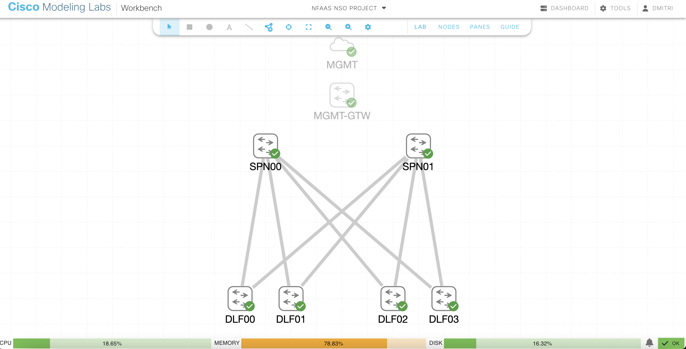
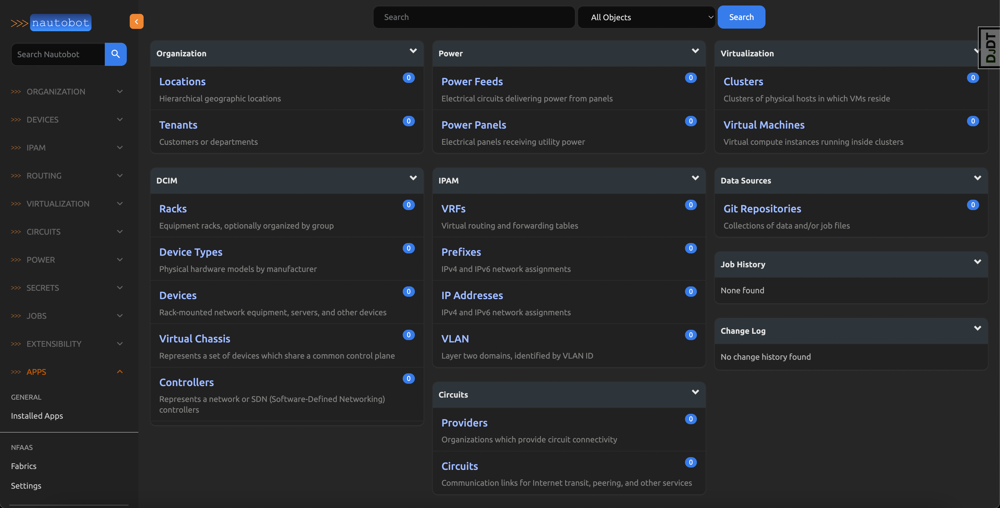
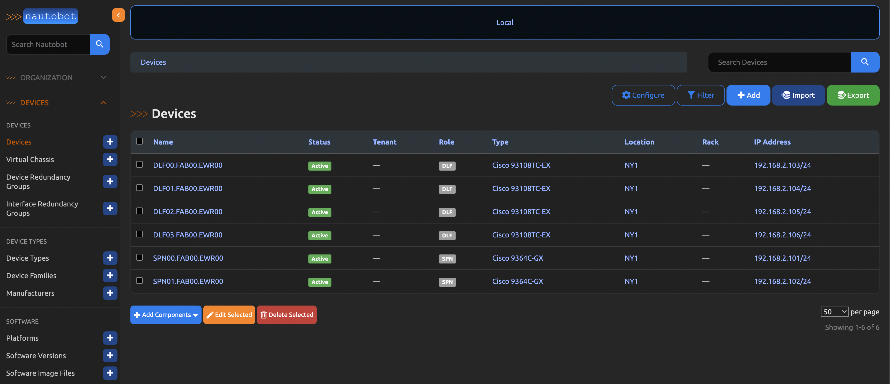

# Network as a Service (NaaS) Automation Platform

## Table of Contents

1. [Introduction](#introduction)
2. [The Challenges of Classical Network Management](#the-challenges-of-classical-network-management)
3. [How Network Automation Solves These Challenges](#how-network-automation-solves-these-challenges)
4. [Introducing the NaaS Automation Platform](#introducing-the-naas-automation-platform)
5. [Key Concepts](#key-concepts)
6. [The CI/CD Loop](#the-cicd-loop)
7. [NaaS Automation Platform Core Technologies and Their Roles](#naas-automation-platform-core-technologies-and-their-roles)
8. [Real-World Example: Network Fabric as a Service (NFaaS)](#real-world-example-network-fabric-as-a-service-nfaas)
9. [Proof of Concept Demo](#proof-of-concept-demo)
10. [Conclusion](#conclusion)

## Introduction

In today's rapidly evolving digital landscape, efficient network management is critical for maintaining scalable and resilient IT infrastructures. Traditional management methods, while providing control, often struggle to keep up with the complexity and speed required in modern environments. This presentation explores the challenges of traditional network management and introduces the **Network as a Service (NaaS) Automation Platform** as a modern solution to address these challenges. The NaaS Automation Platform offers a blueprint for automating and optimizing the full lifecycle of network services, ensuring scalability, consistency, and operational efficiency.

## The Challenges of Classical Network Management

While traditional network management methods—such as manual configurations via the Command Line Interface (CLI)—have long provided granular control, they fall short in addressing the demands of modern networks. As organizations scale and adapt to increasingly complex infrastructures, these manual approaches present several significant challenges:

- **Error-Prone Processes**: Relying on human input for device configuration often results in misconfigurations, leading to network inconsistencies, service disruptions, and increased downtime.
- **Time-Consuming Operations**: Configuring and maintaining a large number of devices individually through CLI is labor-intensive and inefficient, particularly in fast-paced, dynamic environments where rapid changes are necessary.
- **Scalability Limitations**: As network infrastructures grow in size and complexity, traditional manual methods struggle to maintain uniformity and reliability across devices, leading to configuration drift and operational inefficiencies.
- **Limited Collaboration and Visibility**: Without version control or collaboration tools, network changes are often siloed, making it difficult for teams to work together or track configuration history, thus increasing the risk of errors.

These limitations highlight the need for a more streamlined, automated approach to network management—one that reduces manual intervention and supports the scalability, agility, and reliability required by modern IT infrastructures.

## How Network Automation Solves These Challenges

To overcome the limitations of traditional network management, **network automation** provides a modern solution that simplifies and streamlines the process of configuring, managing, and monitoring network devices. By replacing manual, error-prone processes with automated workflows, network automation offers several key advantages:

- **Minimizing Human Error**: By automating configuration tasks, the potential for human errors—such as misconfigurations or inconsistencies—is greatly reduced. Automation ensures that changes are applied uniformly across all devices, leading to a more stable and reliable network environment.
  
- **Improving Efficiency**: Automation drastically reduces the time and effort required to configure and maintain large-scale networks. Engineers can focus on strategic, higher-level tasks while repetitive, time-consuming configuration work is handled automatically, speeding up deployment times and reducing operational overhead.

- **Enabling Scalability**: As networks grow, automation ensures that devices are managed consistently and efficiently, eliminating the scalability limitations of manual processes. Automated systems can handle large numbers of devices without sacrificing reliability, allowing networks to expand seamlessly.

- **Enhancing Collaboration and Visibility**: Automation platforms often integrate version control and collaboration tools, allowing teams to work together more effectively. By tracking changes and maintaining a history of configurations, these tools provide greater transparency and control, reducing the risk of conflicting updates or overlooked errors.

In short, network automation provides the agility, scalability, and consistency required to manage modern networks efficiently, positioning it as a critical solution for overcoming the challenges of classical network management.

## Introducing the NaaS Automation Platform

In response to the growing challenges of classical network management, the **Network as a Service (NaaS) Automation Platform** offers a comprehensive solution to address the complexity, scale, and operational demands of modern networks. The NaaS platform automates and streamlines the full lifecycle of network services across diverse environments, including Enterprise, Data Centers, Cloud, and Service Provider networks.

The NaaS platform introduces a unified approach to managing network infrastructure by applying modern practices such as **Infrastructure as Code (IaC)** and **GitOps**. These principles ensure that all network configurations are maintained in version-controlled repositories, enabling consistent, repeatable, and traceable network changes. By integrating automation into every step of the network service lifecycle—from provisioning to monitoring—NaaS aims to enhance scalability, improve reliability, and reduce manual intervention.

At its core, the NaaS platform leverages the best practices of **NetDevOps**, combining the efficiency of DevOps workflows with the specific needs of network operations. By automating routine tasks, minimizing human error, and supporting collaborative workflows, NaaS empowers organizations to achieve operational excellence, offering an efficient, scalable, and consistent method for managing network services across a variety of environments.

## Key Concepts

### What is Network Automation?

Network automation is the practice of using software to automate the configuration, management, and monitoring of network devices. By automating these processes, organizations reduce the need for manual intervention, which minimizes human errors, speeds up network changes, and improves overall operational efficiency. Automation allows networks to scale more easily and adapt to dynamic environments, supporting faster deployment and consistent management of network infrastructure.

### What is a Platform?

A platform refers to an integrated system of tools and technologies that communicate through **APIs (Application Programming Interfaces)** to achieve a specific goal. In the context of the **NaaS Automation Platform**, it brings together various network automation, monitoring, and task management tools into a cohesive ecosystem. By doing so, it enables seamless workflows for automating the entire network service lifecycle—from provisioning to monitoring—ensuring efficiency and consistency across all network environments.

### What is Infrastructure as Code (IaC)?

Infrastructure as Code (IaC) is a methodology where network and infrastructure configurations are treated as code. This means defining network settings in files, stored in version control systems like Git, which allows for automated and repeatable deployment of configurations. IaC ensures that infrastructure is consistent across environments, reduces manual errors, and makes network changes easier to track, validate, and deploy.

### What is GitOps?

GitOps is an operational model that uses Git as the single source of truth for infrastructure and application configurations. With GitOps, changes are tracked, tested, and applied through **CI/CD pipelines**, ensuring that infrastructure deployments are automated and repeatable. This method provides transparency and traceability, allowing teams to continuously monitor and apply configuration changes reliably and in a controlled manner.

### What is NetDevOps?

NetDevOps extends the principles of DevOps—collaboration, automation, and continuous delivery—into the world of network operations. It applies the same processes used in software development, such as version control, testing, and automation, to network configuration and management. By treating network automation as a software development process, NetDevOps enables faster, more reliable network changes and fosters collaboration between network and operations teams.

### What is CI/CD?

**CI/CD** stands for **Continuous Integration** and **Continuous Delivery/Deployment**. These are automation practices used to speed up the delivery of network changes by integrating and testing code in a continuous manner. In the context of the **NaaS Automation Platform**, CI/CD ensures that network configurations are automatically validated and deployed to the production environment in a reliable, error-free way. It enables faster updates to the network infrastructure while maintaining high standards of quality and consistency.

### What are CI/CD Pipelines?

CI/CD pipelines are automated workflows that manage the continuous integration, testing, and deployment of network configurations. In the **NaaS Automation Platform**, these pipelines validate network changes before they are deployed, ensuring that every configuration is thoroughly tested and meets the required standards. CI/CD pipelines enable organizations to maintain a continuous loop of improvement, monitoring, and feedback for their network operations.

## The CI/CD Loop

The NaaS Automation Platform follows a Continuous Integration and Continuous Delivery (CI/CD) loop to automate the full lifecycle of network services. Each phase of the loop ensures that network changes are implemented efficiently, consistently, and with minimal disruption to the network:

1. **Plan**: Define network changes, requirements, and high-level designs using collaborative tools. This phase establishes the goals and scope of the changes, providing a clear direction for automation and ensuring that all stakeholders are aligned.

2. **Code**: Develop and configure network infrastructure using Infrastructure as Code (IaC) principles. Network configurations are written as code, ensuring they are version-controlled, traceable, and consistent across environments.

3. **Build**: The build process automatically generates the necessary configurations for all network devices and services. During this phase, the system compiles and prepares configurations for physical deployment, ensuring that all components are aligned with the defined design. These configurations are then set up for further validation and testing in the next phase.

4. **Test**: In this phase, network configurations are tested within the virtual testbed. The goal is to ensure the changes meet performance standards, validate connectivity, and check for errors before deployment to the live network.

5. **Release**: After the configurations pass all necessary tests, a release is prepared. The release is reviewed, approved, and marked for deployment, ensuring that the network changes are ready for production.

6. **Deploy**: The validated configurations are rolled out to the live network. The deployment is automated to ensure consistent and accurate application of the changes, with minimal manual intervention and disruption to existing services.

7. **Operate**: Once deployed, the network configurations and services are validated to ensure they are functioning as intended. This phase focuses on checking the stability of the deployment, identifying and resolving any potential issues related to configuration, hardware, or services, ensuring the network operates smoothly post-deployment.

8. **Monitor and Feedback**: After deployment, network performance and stability are continuously monitored by collecting real-time telemetry data. This data provides insights into the health of the network and helps detect potential issues early. The feedback gathered from monitoring not only addresses immediate concerns but also informs future improvements, optimizing network operations through adjustments to automation workflows and system resources.

## NaaS Automation Platform Core Technologies and Their Roles

The NaaS Automation Platform integrates a suite of core technologies, each playing a pivotal role in the automation and management of network services:

### Nautobot
- **Role**: Store and manage network data, configurations, and inventory.
- **Features**: Extensible data models, powerful APIs, and integration capabilities with various network automation tools.
- **Link**: [Nautobot](https://nautobot.readthedocs.io/)

Nautobot is an open-source network automation platform that serves as a **Source of Truth (SoT)** for managing network data, configurations, and inventory. It provides centralized control through its flexible data models and APIs, enabling integration with various automation tools. This ensures consistency and traceability across network operations while streamlining automation workflows in diverse environments.

### Cisco NSO

- **Role**: Provision and manage network devices based on data provided by Nautobot.
- **Features**: Model-driven service orchestration, multi-vendor support, and service lifecycle management.
- **Link**: [Cisco NSO](https://www.cisco.com/c/en/us/products/cloud-systems-management/network-services-orchestrator/index.html)

Cisco Network Services Orchestrator (NSO) is a model-driven service orchestration platform designed for provisioning and managing multi-vendor network devices. NSO abstracts vendor-specific details using standard models like YANG, ensuring seamless and scalable automation across various technologies and environments. It provides end-to-end lifecycle management of services, from initial deployment to updates and decommissioning.

### Service Portal

- **Role**: Customer-facing portal for requesting network services.
- **Features**: Self-service interface, request tracking, and integration with automation processes.

The Service Portal acts as a user-friendly interface for end-users to request network services. It offers a self-service platform for submitting and tracking service requests, automating resource provisioning, and integrating with network management systems to speed up service delivery. The portal simplifies complex workflows, providing transparency and efficiency for both technical and non-technical users.

### Jira/Confluence

- **Role**: Coordination, task tracking, and documentation for human-to-human interactions.
- **Features**: Task management, issue tracking, cross-team collaboration, and centralized documentation.
- **Link**: [Jira](https://www.atlassian.com/software/jira) [Confluence](https://www.atlassian.com/software/confluence)

Jira and Confluence are collaborative tools that streamline task management and documentation. Jira enables task tracking, project management, and issue resolution, while Confluence serves as a centralized repository for documentation such as designs and automation workflows. Together, they enhance coordination and transparency across teams, ensuring efficient task execution and documentation sharing.

### Git/GitHub

- **Role**: Provide version control and a collaborative development environment.
- **Features**: Version control, pull requests, issue tracking, and integration with CI/CD pipelines.
- **Link**: [Git](https://git-scm.com/) [GitHub](https://github.com/home)

Git is a version control system that manages changes in code and configurations, while GitHub adds collaboration features like pull requests, issue tracking, and code reviews. By maintaining version-controlled repositories, GitHub facilitates teamwork, provides traceability, and ensures consistent, reliable updates across network automation workflows.

### kea-dhcp-server

- **Role**: Provide DHCP services for network infrastructures.
- **Features**: High performance, extensibility, and rich configuration options.
- **Link**: [Kea](https://www.isc.org/kea/)

Kea-DHCP is a high-performance, scalable DHCP server designed for dynamic IP address management. It supports both IPv4 and IPv6 networks and offers a modular architecture for customization. With REST API integration, it allows real-time updates to DHCP configurations, making it ideal for modern network infrastructures requiring dynamic resource allocation.

### kea-dns-server

- **Role**: Provide DNS services for dynamic registration of IP addresses and FQDNs.
- **Features**: Automatic DNS registration, high scalability, and support for both IPv4 and IPv6 addressing schemes.
- **Link**: [Kea](https://www.isc.org/kea/)

Kea-DNS is a high-performance, scalable DNS server that automatically manages the registration of IP addresses and Fully Qualified Domain Names (FQDNs). It provides real-time updates and dynamic DNS record management for both IPv4 and IPv6, ensuring accurate and consistent name resolution in fast-evolving network environments.

### Cisco Modeling Labs (CML)

- **Role**: Validate network service changes in a virtual environment.
- **Features**: Virtual network simulation, comprehensive device support, and integration with CI/CD pipelines.
- **Link**: [Cisco Modeling Labs (CML)](https://www.cisco.com/c/en/us/products/cloud-systems-management/modeling-labs/index.html)

Cisco Modeling Labs (CML) is a network simulation tool that allows for the design, testing, and validation of network configurations in a virtualized environment. CML supports a variety of network devices and topologies, enabling thorough validation of network changes before they are applied to production, reducing the risk of errors in complex environments.

### Cisco pyATS

- **Role**: Validate network services.
- **Features**: Automated testing, network device interactions, and comprehensive test coverage.
- **Link**: [Cisco pyATS](https://developer.cisco.com/docs/pyats/)

Cisco pyATS is a test automation framework for validating network services. It allows for automated testing of network devices and configurations, ensuring that all network services, such as connectivity and protocol behaviors, work as expected. By automating testing, pyATS improves reliability and speeds up the validation process in both virtual and physical environments. 

### IxNetwork Virtual Edition (VE)

- **Role**: Test and validate network traffic flows.
- **Features**: Comprehensive network testing, virtual and physical traffic validation, and scalability for production environments.
- **Link**: [IxNetwork Virtual Edition (VE)](https://www.keysight.com/us/en/products/network-test/protocol-load-test/ixnetwork-ve.html)

IxNetwork VE is a network testing tool that simulates and validates network traffic flows in virtual and physical environments. It provides extensive protocol support and performance testing, ensuring that network configurations and services meet operational requirements. IxNetwork VE helps verify that network changes function correctly before deployment, reducing the risk of service disruptions.

### gNMIc and Prometheus

- **Role**: Collect and aggregate telemetry data.
- **Features**: Real-time data collection, flexible querying, and alerting capabilities.
- **Link**: [gNMIc](https://gnmic.openconfig.net/) [Prometheus](https://prometheus.io/)

gNMIc is an open-source tool used to collect real-time telemetry data from network devices via the gNMI protocol. Paired with Prometheus, a robust monitoring system, it aggregates telemetry data, providing flexible querying and real-time alerting capabilities. Together, they offer comprehensive monitoring and visibility into network performance and health.

### Grafana

- **Role**: Visualize and analyze telemetry data.
- **Features**: Interactive dashboards, alerting, and extensive plugin support.
- **Link**: [Grafana](https://grafana.com/)

Grafana is a popular open-source platform for visualizing time-series data from multiple sources. It offers interactive dashboards for monitoring performance metrics such as network health, resource utilization, and latency. With customizable alerting features, Grafana helps engineers quickly identify and address potential issues in network environments.

### PagerDuty

- **Role**: Incident management and alerting.
- **Features**: Real-time alerts, integration with monitoring tools, and automated incident resolution workflows.
- **Link**: [PagerDuty](https://www.pagerduty.com/)

PagerDuty is an incident management platform that provides real-time alerts and automated incident response workflows. It integrates with monitoring tools to aggregate alerts and ensure rapid issue resolution. PagerDuty’s real-time notifications and escalation features enable teams to minimize downtime and maintain network reliability in critical environments.

### HashiCorp Vault

- **Role**: Manage secrets and SSL certificates.
- **Features**: Secure storage, dynamic secrets, and data encryption.
- **Link**: [HashiCorp Vault](https://www.vaultproject.io/)

HashiCorp Vault is a secure tool for managing secrets, such as API keys, passwords, and encryption certificates. It provides secure storage, access control, and dynamic secrets generation, ensuring that sensitive information is encrypted and only accessible to authorized entities. Vault enhances security across distributed systems by simplifying secrets management and automating key processes.

## Real-World Example: Network Fabric as a Service (NFaaS)

The **Network Fabric as a Service (NFaaS)** is one of the network service apps built on top of the **NaaS Automation Platform**. The NFaaS solution runs as a **Nautobot Plugin/App** within the NaaS platform, providing the automation logic necessary to deploy and manage spine/leaf data center fabrics. While NaaS is responsible for integrating various tools such as Nautobot, Cisco NSO, and others, NFaaS introduces specialized automation logic and orchestrates workflows that streamline the entire lifecycle of fabric management, optimizing time to deployment, reducing manual errors, and ensuring consistency across all fabric deployments. This real-world example illustrates how NFaaS automates the process of fulfilling a compute service request through its CI/CD pipeline, leveraging the foundational capabilities of the NaaS platform.

### 1. Plan

The process begins when a client submits an NFaaS compute service request through the Service Portal. The NFaaS Nautobot App evaluates the request and determines that a new spine/leaf fabric is needed to support the requested compute infrastructure. The app then calculates the required number of racks, servers, switches, cabling, and power requirements. Upon approval by the service manager, the NFaaS App initiates automated task generation in Jira, categorizing tasks across purchasing, facilities, and networking teams.

### 2. Code

Network engineers use the NFaaS App to generate the Low-Level Design (LLD) in YAML format. Predefined service templates within the app are leveraged to generate all the necessary configurations for setting up the spine/leaf fabric, including VLANs, IP prefixes, and address assignments, along with underlay and overlay network setups. The LLD also defines the rack layout, specifying the placement of servers and network devices, as well as the cabling requirements between spine and leaf switches. Once the YAML files are finalized, they are committed to GitHub, where version control tracks changes and allows for rollbacks if necessary. This process ensures the configurations are prepared for the CI/CD pipeline.

### 3. Build

After the YAML files are committed to GitHub, the **CI/CD pipeline** is automatically triggered to begin the build phase. During this phase, the automation pipelines generate the necessary configurations for all components required to deploy the spine/leaf fabric. This includes generating configurations for **Cisco NSO**, which will later provision the physical network devices, such as the spine and leaf switches. Additionally, configurations for the **DHCP** and **DNS** servers are created to handle IP allocation and name resolution for devices in the fabric. **Base configurations** for the spine and leaf devices are generated to enable **zero-touch provisioning** via TFTP.

Finally, topology definitions for **Cisco Modeling Labs (CML)** are prepared, allowing the network architecture to be simulated for testing purposes. By the end of this phase, all configurations are aligned and ready for the subsequent testing and deployment stages.

### 4. Test

With the virtual testbed environment built using the CML topology definitions, the Test phase focuses on validating all the configurations generated in the Build phase. These configurations are tested to ensure they align with the design specifications. **Cisco pyATS** is used to automate the testing of the network configurations and services, performing comprehensive tests to validate key network functions such as device connectivity, protocol correctness, and the proper operation of routing protocols. Additionally, network services like **DHCP**, **DNS**, and **NTP** are also tested to ensure they are functioning correctly across the fabric.

Following the pyATS validations, **IxNetwork Virtual Edition (VE)** is employed to simulate and test network traffic flows across the virtual fabric environment. This ensures that routing and switching operations between spine and leaf devices behave as expected.

### 5. Release

Once all tests have passed successfully in the virtual spine/leaf fabric, the validated configurations are packaged into a new release. This release is committed to the GitHub repository, marking it as ready for the next phase.

Before proceeding, the release undergoes a review by the control change committee to ensure compliance with organizational standards and policies. It is then scheduled for implementation during a designated maintenance window, minimizing any potential impact on live services while maintaining accountability and control throughout the process.

### 6. Deploy

Once the release is scheduled, the NFaaS App initiates the deployment process during the designated maintenance window. The app pulls the release and applies the configurations to ensure the spine/leaf fabric is correctly provisioned. It updates the Nautobot database to reflect the latest network state and coordinates the execution of workflows that push the prepared configurations to all network devices and services, while also enabling monitoring systems.

In the event of any issues during deployment, the app can trigger an automatic rollback, restoring the network to the last stable configuration. This rollback capability minimizes service disruption, ensuring a seamless recovery process if any errors or inconsistencies are detected.

### 7. Operate

After the spine/leaf fabric is live, field technicians can use Grafana dashboards to monitor and validate the physical infrastructure of the fabric. These dashboards provide real-time insights into key hardware metrics such as link health, device connectivity, and resource utilization. Technicians can quickly identify issues like miswired cables, down interfaces, or hardware failures, including faulty linecards, transceivers, fan malfunctions, and power supply unit (PSU) issues. By analyzing metrics technicians can troubleshoot and resolve potential physical issues that might disrupt network performance.

Network engineers leverage NFaaS validation workflows to ensure that the logical configurations and services deployed on the fabric are functioning as expected. Engineers validate critical fabric services, such as OSPF, BGP, DHCP, DNS, and NTP, ensuring that these services are operating correctly across the fabric.

### 8. Monitor and Feedback

Once the spine/leaf fabric is operational, continuous monitoring ensures its performance and stability by collecting real-time telemetry data from the fabric’s switches. Metrics like throughput, CPU utilization, and link health are visualized in Grafana to provide engineers with real-time insights and detect potential bottlenecks or degraded performance. **PagerDuty** is integrated to send real-time alerts to engineers if any critical issues, such as hardware failures or significant performance drops, are detected, enabling immediate responses and ensuring that the network remains operational.

This feedback is not only used to address immediate issues but also informs future planning cycles, driving continuous improvement. Feedback loops play a crucial role in optimizing automation workflows, incorporating predictive analytics, and introducing dynamic scaling based on traffic patterns. By analyzing telemetry data, the platform can improve fault tolerance by adjusting failover procedures, enhancing service provisioning logic, or fine-tuning resource allocation. Additionally, feedback from operational data helps strengthen security protocols and detect vulnerabilities, ensuring the network remains resilient and adaptive to evolving operational needs.

## **Proof of Concept Demo**

This demo demonstrates how the NFaaS App can be used to design, translate, and deploy a small spine/leaf fabric. The process involves defining a high-level design (HLD) template, converting it into a low-level design (LLD) using YAML, and deploying the LLD within the NFaaS App. This demo highlights the transformation of an HLD template into a deployable configuration and illustrates how the NFaaS App manages deployment and automation through a series of structured steps. The HLD template provides a reusable spine/leaf design framework, allowing customization for specific deployment needs within the NFaaS platform.

Network engineers interact with the NFaaS platform using Nautobot jobs. These are custom-developed automation tasks written in Python, specifically designed for the NFaaS App. These jobs enable engineers to perform tasks such as pulling configuration data, updating network inventory, and deploying network services. Leveraging these jobs allows network developers to automate complex workflows, efficiently manage network changes, and focus on the higher-level aspects of network design and deployment.

### High-Level Design

#### Spine/Leaf Fabric Diagram


#### Device Roles and Models
- **Spine Devices**:
  - Two spine switches (SPN00 and SPN01), both Cisco Nexus 9364C-GX models.
  - Each spine has loopback and management IPs, as well as multiple physical Ethernet interfaces.
  - Spine switches connect to each leaf switch through multiple port-channels (LAGs), providing redundant uplinks.

- **Leaf Devices**:
  - Four leaf switches (DLF00, DLF01, DLF02, and DLF03), all Cisco Nexus 93108TC-EX models.
  - Each leaf switch is equipped with loopback and management IPs and connects to the spine switches via physical interfaces aggregated into port-channels for redundancy.

#### Network Architecture and IP Addressing
- **Management Network**:
  - Management IP addresses are assigned within a **/24** subnet for the management interfaces (mgmt0) on all devices, ensuring secure, isolated management traffic.
- **Fabric Network**:
  - A **/20** network is assigned to the fabric and then subdivided into subnets for different functions, such as loopback0 interfaces used for router-ids, with each switch assigned a unique /32 address within a dedicated loopback range.

#### Port Channels and Physical Connectivity
- **Port Channels**:
  - Port-channels are pre-configured between each spine and leaf pair but are initially set to **disabled**.
  - Each spine switch has four port-channels (po101-po104 on SPN00 and po201-po204 on SPN01), each consisting of two physical interfaces that connect to the corresponding ports on the leaf switches. 
  - Each leaf switch has uplink port-channels to the spines, allowing for active/active or active/standby configurations as needed.
  
#### VLAN and Routing
- **VLAN Configuration**:
  - A single VLAN (VLAN 1) is designated as the **default VLAN** across the fabric, supporting basic L2 connectivity.
- **Routing**:
  - The spine switches are configured to support L3 connectivity and routing between the leaf devices.
  - During initial deployment, all port-channels are disabled. In a subsequent release, the port-channels are enabled, allowing full routing and redundancy across the fabric.

#### Release Phases
The deployment is planned in two release phases:
1. **Initial Release**: The full configuration is deployed with port-channels set to **disabled**, allowing for initial network setup and connectivity validation.
2. **Second Release**: Port-channels are activated to provide **redundant uplinks** and complete the fabric’s spine/leaf architecture.

This HLD template provides a foundation for converting the setup into a YAML-based Low-Level Design (LLD) that details each element’s specific configurations and prepares it for deployment using the NFaaS platform.

### Low-Level Design

In the NFaaS App, only four main parameters—Site, Data Center, Building, and Fabric Size—are required to generate the YAML code for the Low-Level Design (LLD). The app uses these inputs to dynamically create the detailed LLD configurations needed for fabric deployment. The tables below serve as a visual aid to represent this information, breaking down the essential elements such as VLANs, IP prefixes, and device configurations. This allows for a clearer understanding of the configuration elements that will be converted into a YAML file for deployment.

#### **Fabric Details**

| Parameter        | Value        |
|------------------|--------------|
| **Site**         | EWR00        |
| **Data Center**  | Equinix      |
| **Building**     | NY1          |
| **Fabric Size**  | Small        |
| Fabric ID        | FAB00        |
| Name             | FAB00.EWR00  |

#### **VLANs**

| VLAN ID (vid) | Name    |
|---------------|---------|
| 1             | Default |

#### **IP Prefixes**

| Prefix           | Type       | Role                              |
|------------------|------------|-----------------------------------|
| 192.168.2.0/24   | network    | FABRIC::MGMT                      |
| 10.0.0.0/20      | container  | FABRIC                            |
| 10.0.0.0/24      | container  | FABRIC::LOOPBACK0                 |
| 10.0.0.0/28      | container  | FABRIC::LOOPBACK0::SPN            |
| 10.0.0.16/28     | container  | FABRIC::LOOPBACK0::DLF            |
| 10.0.0.0/32      | network    | FABRIC::LOOPBACK0::ROUTER_ID      |
| 10.0.0.1/32      | network    | FABRIC::LOOPBACK0::ROUTER_ID      |
| 10.0.0.16/32     | network    | FABRIC::LOOPBACK0::ROUTER_ID      |
| 10.0.0.17/32     | network    | FABRIC::LOOPBACK0::ROUTER_ID      |
| 10.0.0.18/32     | network    | FABRIC::LOOPBACK0::ROUTER_ID      |
| 10.0.0.19/32     | network    | FABRIC::LOOPBACK0::ROUTER_ID      |

#### **Devices**

| Device Name          | Model       | Role | NSO NED ID     | mgmt0 IP (DHCP) 	| Lo0 IP       |
|----------------------|-------------|------|----------------|------------------|--------------|
| SPN00.FAB00.EWR00    | 9364C-GX    | SPN  | NX-OS-nc-10.3  | 192.168.2.101/24 | 10.0.0.0/32  |
| SPN01.FAB00.EWR00    | 9364C-GX    | SPN  | NX-OS-nc-10.3  | 192.168.2.102/24 | 10.0.0.1/32  |
| DLF00.FAB00.EWR00    | 93108TC-EX  | DLF  | NX-OS-nc-10.3  | 192.168.2.103/24 | 10.0.0.16/32 |
| DLF01.FAB00.EWR00    | 93108TC-EX  | DLF  | NX-OS-nc-10.3  | 192.168.2.104/24 | 10.0.0.17/32 |
| DLF02.FAB00.EWR00    | 93108TC-EX  | DLF  | NX-OS-nc-10.3  | 192.168.2.105/24 | 10.0.0.18/32 |
| DLF03.FAB00.EWR00    | 93108TC-EX  | DLF  | NX-OS-nc-10.3  | 192.168.2.106/24 | 10.0.0.19/32 |

#### **Interface Roles and Configurations**

##### **Spine Switches (SPN00 & SPN01)**

| Interfaces       | Role     | Status | Enabled | MTU  | VLAN |
|------------------|----------|--------|---------|------|------|
| mgmt0            | N/A      | Active | Yes     | 1500 | N/A  |
| lo0              | N/A      | Active | Yes     | 1500 | N/A  |
| poXXX            | N/A      | Active | Yes     | 9216 | N/A  |
| eth1/1 - eth1/8  | Downlink | Active | Yes     | 9216 | N/A  |
| eth1/9 - eth1/64 | N/A      | Unused | No      | 1500 | 1    |

##### **Leaf Switches (DLF00 - DLF03)**

| Interfaces       | Role     | Status | Enabled | MTU  | VLAN |
|------------------|----------|--------|---------|------|------|
| mgmt0            | N/A      | Active | Yes     | 1500 | N/A  |
| lo0              | N/A      | Active | Yes     | 1500 | N/A  |
| poXXX            | N/A      | Active | Yes     | 9216 | N/A  |
| eth1/1 - eth1/4  | Uplink   | Active | Yes     | 9216 | N/A  |
| eth1/5 - eth1/54 | N/A      | Unused | No      | 1500 | 1    |

#### **Port-Channels and Member Interfaces**

##### **SPN00.FAB00.EWR00**

| Port-Channel | Member Interfaces   | Connected Leaf Switch |
|--------------|---------------------|-----------------------|
| **po101**    | eth1/1, eth1/2      | DLF00.FAB00.EWR00     |
| **po102**    | eth1/3, eth1/4      | DLF01.FAB00.EWR00     |
| **po103**    | eth1/5, eth1/6      | DLF02.FAB00.EWR00     |
| **po104**    | eth1/7, eth1/8      | DLF03.FAB00.EWR00     |

##### **SPN01.FAB00.EWR00**

| Port-Channel | Member Interfaces   | Connected Leaf Switch |
|--------------|---------------------|-----------------------|
| **po201**    | eth1/1, eth1/2      | DLF00.FAB00.EWR00     |
| **po202**    | eth1/3, eth1/4      | DLF01.FAB00.EWR00     |
| **po203**    | eth1/5, eth1/6      | DLF02.FAB00.EWR00     |
| **po204**    | eth1/7, eth1/8      | DLF03.FAB00.EWR00     |

##### **DLF00.FAB00.EWR00**

| Port-Channel | Member Interfaces   | Connected Spine Switch |
|--------------|---------------------|------------------------|
| **po101**    | eth1/1, eth1/2      | SPN00.FAB00.EWR00      |
| **po201**    | eth1/3, eth1/4      | SPN01.FAB00.EWR00      |

##### **DLF01.FAB00.EWR00**

| Port-Channel | Member Interfaces   | Connected Spine Switch |
|--------------|---------------------|------------------------|
| **po102**    | eth1/1, eth1/2      | SPN00.FAB00.EWR00      |
| **po202**    | eth1/3, eth1/4      | SPN01.FAB00.EWR00      |

##### **DLF02.FAB00.EWR00**

| Port-Channel | Member Interfaces   | Connected Spine Switch |
|--------------|---------------------|------------------------|
| **po103**    | eth1/1, eth1/2      | SPN00.FAB00.EWR00      |
| **po203**    | eth1/3, eth1/4      | SPN01.FAB00.EWR00      |

##### **DLF03.FAB00.EWR00**

| Port-Channel | Member Interfaces   | Connected Spine Switch |
|--------------|---------------------|------------------------|
| **po104**    | eth1/1, eth1/2      | SPN00.FAB00.EWR00      |
| **po204**    | eth1/3, eth1/4      | SPN01.FAB00.EWR00      |

##### **Connections Between Devices**

| A Device               | A Interface | B Device               | B Interface |
|------------------------|-------------|------------------------|-------------|
| SPN00.FAB00.EWR00      | eth1/1      | DLF00.FAB00.EWR00      | eth1/1      |
| SPN00.FAB00.EWR00      | eth1/2      | DLF00.FAB00.EWR00      | eth1/2      |
| SPN00.FAB00.EWR00      | eth1/3      | DLF01.FAB00.EWR00      | eth1/1      |
| SPN00.FAB00.EWR00      | eth1/4      | DLF01.FAB00.EWR00      | eth1/2      |
| SPN00.FAB00.EWR00      | eth1/5      | DLF02.FAB00.EWR00      | eth1/1      |
| SPN00.FAB00.EWR00      | eth1/6      | DLF02.FAB00.EWR00      | eth1/2      |
| SPN00.FAB00.EWR00      | eth1/7      | DLF03.FAB00.EWR00      | eth1/1      |
| SPN00.FAB00.EWR00      | eth1/8      | DLF03.FAB00.EWR00      | eth1/2      |
| SPN01.FAB00.EWR00      | eth1/1      | DLF00.FAB00.EWR00      | eth1/3      |
| SPN01.FAB00.EWR00      | eth1/2      | DLF00.FAB00.EWR00      | eth1/4      |
| SPN01.FAB00.EWR00      | eth1/3      | DLF01.FAB00.EWR00      | eth1/3      |
| SPN01.FAB00.EWR00      | eth1/4      | DLF01.FAB00.EWR00      | eth1/4      |
| SPN01.FAB00.EWR00      | eth1/5      | DLF02.FAB00.EWR00      | eth1/3      |
| SPN01.FAB00.EWR00      | eth1/6      | DLF02.FAB00.EWR00      | eth1/4      |
| SPN01.FAB00.EWR00      | eth1/7      | DLF03.FAB00.EWR00      | eth1/3      |
| SPN01.FAB00.EWR00      | eth1/8      | DLF03.FAB00.EWR00      | eth1/4      |

<details>
  <summary>Click here to view the YAML LLD file</summary>

```yaml
# Fabric Details
name: FAB00.EWR00  # Fabric ID and Name for reference
data_center: Equinix  # Specifies the Data Center
site: EWR00  # Site code for the location within the Data Center
building: NY1  # Physical location within the data center
fabric_id: FAB00  # Unique identifier for this fabric
fabric_size: small  # Indicates the fabric size category

# VLAN Configuration
vlans:
  - vid: 1
    name: Default  # VLAN ID and Name

# IP Prefixes for the network architecture
prefixes:
  - prefix: 192.168.2.0/24
    type: network
    role: FABRIC::MGMT  # Management network for the devices
  - prefix: 10.0.0.0/20
    type: container
    role: FABRIC  # Container for all fabric-related IP ranges
  - prefix: 10.0.0.0/24
    type: container
    role: FABRIC::LOOPBACK0  # Container for loopback IPs across devices
  - prefix: 10.0.0.0/28
    type: container
    role: FABRIC::LOOPBACK0::SPN  # Loopback range for Spine devices
  - prefix: 10.0.0.16/28
    type: container
    role: FABRIC::LOOPBACK0::DLF  # Loopback range for Leaf devices
  - prefix: 10.0.0.0/32
    type: network
    role: FABRIC::LOOPBACK0::ROUTER_ID  # Individual router IDs for specific devices
  - prefix: 10.0.0.1/32
    type: network
    role: FABRIC::LOOPBACK0::ROUTER_ID
  - prefix: 10.0.0.16/32
    type: network
    role: FABRIC::LOOPBACK0::ROUTER_ID
  - prefix: 10.0.0.17/32
    type: network
    role: FABRIC::LOOPBACK0::ROUTER_ID
  - prefix: 10.0.0.18/32
    type: network
    role: FABRIC::LOOPBACK0::ROUTER_ID
  - prefix: 10.0.0.19/32
    type: network
    role: FABRIC::LOOPBACK0::ROUTER_ID
devices:
  - name: SPN00.FAB00.EWR00  # Device name
    model: 9364C-GX  # Device model, Nexus 9364C-GX as a spine device
    role: SPN  # Assigned role as a spine switch
    nso_ned_id: NX-OS-nc-10.3  # Cisco NX-OS Netconf NED ID for NSO integration
    interfaces:
      - name: mgmt0  # Interface name
        enabled: True  # Management interface enabled for out-of-band management
        ip_addresses:
          - ip_address: 192.168.2.101/24  # Assigned IP address within the management subnet
            primary_ip4: true  # Primary management IP for remote access and monitoring
      - name: lo0
        enabled: True
        type: virtual  # Virtual interface type for loopbacks
        ip_addresses:
          - ip_address: 10.0.0.0/32  # Unique loopback IP for device identification in routing
      - name: po101
        enabled: False  # Port-channel initially disabled; enabled in a later deployment stage
        mtu: 9216  # Jumbo MTU setting to support high-throughput traffic
        type: lag  # Link aggregation for redundancy to leaf switches
      - name: po102
        enabled: False
        mtu: 9216
        type: lag
      - name: po103
        enabled: False
        mtu: 9216
        type: lag
      - name: po104
        enabled: False
        mtu: 9216
        type: lag
      - name: eth1/[1-8]
        enabled: True  # Physical interfaces enabled to support traffic to leaf switches
        mtu: 9216
        role: Downlink  # Role as downlink ports for leaf connectivity
      - name: eth1/[9-64]
        status: Unused  # Designated as unused to keep them isolated from the primary fabric
        enabled: False  # Disabled to prevent accidental traffic on unused ports
        mode: Access  # Set to access mode in case VLAN traffic is needed in future
        untagged_vlan: 1  # Assigned default VLAN for unused ports
    lags:
      - name: po101
        members:
          - member: eth1/1  # Aggregates physical interfaces for increased redundancy and throughput
          - member: eth1/2
      - name: po102
        members:
          - member: eth1/3
          - member: eth1/4
      - name: po103
        members:
          - member: eth1/5
          - member: eth1/6
      - name: po104
        members:
          - member: eth1/7
          - member: eth1/8
  - name: SPN01.FAB00.EWR00
    model: 9364C-GX
    role: SPN
    nso_ned_id: NX-OS-nc-10.3
    interfaces:
      - name: mgmt0
        enabled: True
        ip_addresses:
          - ip_address: 192.168.2.102/24
            primary_ip4: true
      - name: lo0
        enabled: True
        type: virtual
        ip_addresses:
          - ip_address: 10.0.0.1/32
      - name: po201
        enabled: False
        mtu: 9216
        type: lag
      - name: po202
        enabled: False
        mtu: 9216
        type: lag
      - name: po203
        enabled: False
        mtu: 9216
        type: lag
      - name: po204
        enabled: False
        mtu: 9216
        type: lag
      - name: eth1/[1-8]
        enabled: True
        mtu: 9216
        role: Downlink
      - name: eth1/[9-64]
        status: Unused
        enabled: False
        mode: Access
        untagged_vlan: 1
    lags:
      - name: po201
        members:
          - member: eth1/1
          - member: eth1/2
      - name: po202
        members:
          - member: eth1/3
          - member: eth1/4
      - name: po203
        members:
          - member: eth1/5
          - member: eth1/6
      - name: po204
        members:
          - member: eth1/7
          - member: eth1/8
  - name: DLF00.FAB00.EWR00
    model: 93108TC-EX
    role: DLF
    nso_ned_id: NX-OS-nc-10.3
    interfaces:
      - name: mgmt0
        enabled: True
        ip_addresses:
          - ip_address: 192.168.2.103/24
            primary_ip4: true
      - name: lo0
        enabled: True
        type: virtual
        ip_addresses:
          - ip_address: 10.0.0.16/32
      - name: po101
        enabled: False
        mtu: 9216
        type: lag
      - name: po201
        enabled: False
        mtu: 9216
        type: lag
      - name: eth1/[1-4]
        enabled: True
        mtu: 9216
        role: Uplink
      - name: eth1/[5-54]
        status: Unused
        enabled: False
        mode: Access
        untagged_vlan: 1
    lags:
      - name: po101
        members:
          - member: eth1/1
          - member: eth1/2
      - name: po201
        members:
          - member: eth1/3
          - member: eth1/4
  - name: DLF01.FAB00.EWR00
    model: 93108TC-EX
    role: DLF
    nso_ned_id: NX-OS-nc-10.3
    interfaces:
      - name: mgmt0
        enabled: True
        ip_addresses:
          - ip_address: 192.168.2.104/24
            primary_ip4: true
      - name: lo0
        enabled: True
        type: virtual
        ip_addresses:
          - ip_address: 10.0.0.17/32
      - name: po102
        enabled: False
        mtu: 9216
        type: lag
      - name: po202
        enabled: False
        mtu: 9216
        type: lag
      - name: eth1/[1-4]
        enabled: True
        mtu: 9216
        role: Uplink
      - name: eth1/[5-54]
        status: Unused
        enabled: False
        mode: Access
        untagged_vlan: 1
    lags:
      - name: po102
        members:
          - member: eth1/1
          - member: eth1/2
      - name: po202
        members:
          - member: eth1/3
          - member: eth1/4
  - name: DLF02.FAB00.EWR00
    model: 93108TC-EX
    role: DLF
    nso_ned_id: NX-OS-nc-10.3
    interfaces:
      - name: mgmt0
        enabled: True
        ip_addresses:
          - ip_address: 192.168.2.105/24
            primary_ip4: true
      - name: lo0
        enabled: True
        type: virtual
        ip_addresses:
          - ip_address: 10.0.0.18/32
      - name: po103
        enabled: False
        mtu: 9216
        type: lag
      - name: po203
        enabled: False
        mtu: 9216
        type: lag
      - name: eth1/[1-4]
        enabled: True
        mtu: 9216
        role: Uplink
      - name: eth1/[5-54]
        status: Unused
        enabled: False
        mode: Access
        untagged_vlan: 1
    lags:
      - name: po103
        members:
          - member: eth1/1
          - member: eth1/2
      - name: po203
        members:
          - member: eth1/3
          - member: eth1/4
  - name: DLF03.FAB00.EWR00
    model: 93108TC-EX
    role: DLF
    nso_ned_id: NX-OS-nc-10.3
    interfaces:
      - name: mgmt0
        enabled: True
        ip_addresses:
          - ip_address: 192.168.2.106/24
            primary_ip4: true
      - name: lo0
        enabled: True
        type: virtual
        ip_addresses:
          - ip_address: 10.0.0.19/32
      - name: po104
        enabled: False
        mtu: 9216
        type: lag
      - name: po204
        enabled: False
        mtu: 9216
        type: lag
      - name: eth1/[1-4]
        enabled: True
        mtu: 9216
        role: Uplink
      - name: eth1/[5-54]
        status: Unused
        enabled: False
        mode: Access
        untagged_vlan: 1
    lags:
      - name: po104
        members:
          - member: eth1/1
          - member: eth1/2
      - name: po204
        members:
          - member: eth1/3
          - member: eth1/4
connections:
  - a_device: SPN00.FAB00.EWR00
    a_interface: eth1/1
    b_device: DLF00.FAB00.EWR00
    b_interface: eth1/1
  - a_device: SPN00.FAB00.EWR00
    a_interface: eth1/2
    b_device: DLF00.FAB00.EWR00
    b_interface: eth1/2
  - a_device: SPN00.FAB00.EWR00
    a_interface: eth1/3
    b_device: DLF01.FAB00.EWR00
    b_interface: eth1/1
  - a_device: SPN00.FAB00.EWR00
    a_interface: eth1/4
    b_device: DLF01.FAB00.EWR00
    b_interface: eth1/2
  - a_device: SPN00.FAB00.EWR00
    a_interface: eth1/5
    b_device: DLF02.FAB00.EWR00
    b_interface: eth1/1
  - a_device: SPN00.FAB00.EWR00
    a_interface: eth1/6
    b_device: DLF02.FAB00.EWR00
    b_interface: eth1/2
  - a_device: SPN00.FAB00.EWR00
    a_interface: eth1/7
    b_device: DLF03.FAB00.EWR00
    b_interface: eth1/1
  - a_device: SPN00.FAB00.EWR00
    a_interface: eth1/8
    b_device: DLF03.FAB00.EWR00
    b_interface: eth1/2
  - a_device: SPN01.FAB00.EWR00
    a_interface: eth1/1
    b_device: DLF00.FAB00.EWR00
    b_interface: eth1/3
  - a_device: SPN01.FAB00.EWR00
    a_interface: eth1/2
    b_device: DLF00.FAB00.EWR00
    b_interface: eth1/4
  - a_device: SPN01.FAB00.EWR00
    a_interface: eth1/3
    b_device: DLF01.FAB00.EWR00
    b_interface: eth1/3
  - a_device: SPN01.FAB00.EWR00
    a_interface: eth1/4
    b_device: DLF01.FAB00.EWR00
    b_interface: eth1/4
  - a_device: SPN01.FAB00.EWR00
    a_interface: eth1/5
    b_device: DLF02.FAB00.EWR00
    b_interface: eth1/3
  - a_device: SPN01.FAB00.EWR00
    a_interface: eth1/6
    b_device: DLF02.FAB00.EWR00
    b_interface: eth1/4
  - a_device: SPN01.FAB00.EWR00
    a_interface: eth1/7
    b_device: DLF03.FAB00.EWR00
    b_interface: eth1/3
  - a_device: SPN01.FAB00.EWR00
    a_interface: eth1/8
    b_device: DLF03.FAB00.EWR00
    b_interface: eth1/4

```
</details>

### **Demo**

This demonstration explains how the NFaaS App integrates with Nautobot to pull LLD YAML files from repositories, update the Nautobot database, and deploy network configurations using Cisco NSO. Beginning with a clean Nautobot database, this demo outlines the process of configuring the NFaaS App, managing network inventory, and completing the deployment. The steps below describe the entire process in detail:

1. **Configure NFaaS App**: Set up the NFaaS App by providing essential configuration details, such as the GitHub organization URL, NFaaS inventory repository, and GitHub API token. This ensures the app can access and manage the necessary resources.
2. **Load Inventory**: Populate Nautobot with network inventory from the defined GitHub repository, using the NFaaS App to bring in device types, their roles, locations, etc. For more details on the repository, check the [NFaaS Nautobot Inventory GitHub repository](https://github.com/nikonet-us/nfaas-nautobot-inventory).
3. **Add New Fabric**: Import a fabric's configuration from the GitHub repository. The NFaaS App will pull the necessary YAML files, apply the fabric details to update Nautobot, and deploy the configurations.
4. **Update the Fabric**: Modify the configuration of an existing fabric, such as enabling additional links or changing the VLAN setup, and redeploy the updated design.
5. **Delete the Fabric**: Finally, remove the fabric from Nautobot, demonstrating the full lifecycle management of a network fabric using the NFaaS App.

#### **Starting with a Clean Nautobot Database**



This screenshot illustrates the initial state of Nautobot, with a clean database and NFaaS App installed.

#### **Configure NFaaS App**

This section outlines the steps for configuring the NFaaS App, detailing how to access and modify the necessary settings:

1. **Navigate to NFaaS Settings**  
   To update the NFaaS App settings, access **Apps > NFaaS > Settings** within Nautobot. The screenshot below illustrates the starting point for configuration:  
   

2. **Edit Settings**  
   The **Edit** button allows for updating the NFaaS settings, providing essential configuration details:  
   

3. **Update Information**  
   The fields are populated with the required information, and **Update** is clicked to save the configuration changes:  
   

#### **Load Inventory**

This section details the steps for loading inventory data into Nautobot using the NFaaS App, which pulls inventory information from GitHub and updates the Nautobot database:

1. **Navigate to Update Inventory Job**  
   Access **Jobs > Jobs** and click **Update Inventory**:  
   

2. **Run Update Inventory Job**  
   An inventory GitHub release is selected from the **Release** dropdown, and **Run Job Now** is clicked to initiate the job.

   

   Nautobot starts the job and provides logs for monitoring progress.

   

   Once completed, the inventory is successfully loaded.

   

3. **View Added Locations**  
   The **Organization > Locations** section is used to verify the locations added during the inventory update:  
   

4. **View Added Device Types**  
   The **Devices > Device Types** section is accessed to verify the imported device types:  
   

These details explain how the inventory is loaded into Nautobot using the NFaaS App, ensuring that data from GitHub is successfully imported and visible in the system.

#### **Add Fabric**

This section provides details on adding a new fabric to the NFaaS platform using the NFaaS App Nautobot Jobs:

1. **Navigate to Add Fabric Job**  
   Access **Jobs > Jobs** and click **Add Fabric**:  
   

2. **Add New Fabric**  
   The fabric name to deploy is selected from the **Fabric** dropdown:  
   

   The appropriate fabric release is then chosen from the **Release** dropdown:  
   

   Clicking **Run Job Now** initiates the deployment:  
   

   Nautobot starts the job and provides logs for monitoring progress.

   Once completed, the fabric is successfully added:  
   

   A log message indicating a successful deployment is displayed:
   > "Successfully created fabric FAB00.EWR00 with release v1.0.0 and pushed the configuration to NSO."

3. **View Added Fabric**  
   The **NFaaS > Fabrics** section is accessed to verify that the new fabric has been added:  
   

   Clicking on the fabric name displays additional details, such as the release version and related information:  
   

4. **View Added Devices**  
   The **Devices > Devices** section is accessed to check the devices added as part of the fabric deployment:  
   

5. **View LAG Interfaces**  
   The **Devices > Interfaces** section is used to view LAG interfaces. Clicking **Filter** and selecting **Link Aggregation Group (LAG)** from the **Type** dropdown, followed by clicking **Apply**, displays all LAG interfaces:  
   

   The screenshot shows that all LAG interfaces are currently disabled.

6. **Login to Devices and Validate Port-Channels Status**  
   The state of the port-channels can be verified by logging into each device and running the following command:

   ```
   $ ssh cisco@192.168.2.101
   (cisco@192.168.2.101) Password: 

    SPN00.FAB00.EWR00# show port-channel summary 
    Flags:  D - Down        P - Up in port-channel (members)
            I - Individual  H - Hot-standby (LACP only)
            s - Suspended   r - Module-removed
            b - BFD Session Wait
            S - Switched    R - Routed
            U - Up (port-channel)
            p - Up in delay-lacp mode (member)
            M - Not in use. Min-links not met
    --------------------------------------------------------------------------------
    Group Port-       Type     Protocol  Member Ports
          Channel
    --------------------------------------------------------------------------------
    101   Po101(RD)   Eth      LACP      Eth1/1(D)    Eth1/2(D)    
    102   Po102(RD)   Eth      LACP      Eth1/3(D)    Eth1/4(D)    
    103   Po103(RD)   Eth      LACP      Eth1/5(D)    Eth1/6(D)    
    104   Po104(RD)   Eth      LACP      Eth1/7(D)    Eth1/8(D)    
    SPN00.FAB00.EWR00#     
   ```

   The same check is performed on other devices, ensuring that the port-channels are in the expected state, as indicated by the `Down (D)` status for each port-channel.

   These details, along with the verification process, demonstrate that the fabric has been deployed correctly, with all interfaces configured as per the desired specifications.

#### **Update the Fabric**

This section describes the process for updating the configuration of an existing fabric in the NFaaS platform using the NFaaS App Nautobot Jobs:

1. **Navigate to Update Fabric Job**  
   Access **Jobs > Jobs** and click **Update Fabric**:  
   

2. **Update Existing Fabric**  
   The fabric name to update is selected from the **Fabric** dropdown:  
   

   The appropriate fabric release is then chosen from the **Release** dropdown:  
   

   Clicking **Run Job Now** initiates the update. Upon successful completion, the following log message is displayed:
   > "Successfully updated fabric FAB00.EWR00 from v1.0.0 to release v1.0.1 and pushed the configuration to NSO."

3. **View LAG Interfaces**  
   The **Devices > Interfaces** section is accessed to view LAG interfaces. Click **Filter**, select **Link Aggregation Group (LAG)** from the **Type** dropdown, and click **Apply** to display all LAG interfaces:  
   

   The screenshot shows that all LAG interfaces are now enabled.

4. **Login to Devices and Validate Port-Channels Status**  
   The state of the port-channels can be verified by logging into each device and running the following command:

   ```
   $ ssh cisco@192.168.2.101
   (cisco@192.168.2.101) Password: 

   SPN00.FAB00.EWR00# show port-channel summary 
   Flags:  D - Down        P - Up in port-channel (members)
           I - Individual  H - Hot-standby (LACP only)
           s - Suspended   r - Module-removed
           b - BFD Session Wait
           S - Switched    R - Routed
           U - Up (port-channel)
           p - Up in delay-lacp mode (member)
           M - Not in use. Min-links not met
   --------------------------------------------------------------------------------
   Group Port-       Type     Protocol  Member Ports
         Channel
   --------------------------------------------------------------------------------
   101   Po101(RU)   Eth      LACP      Eth1/1(P)    Eth1/2(P)    
   102   Po102(RU)   Eth      LACP      Eth1/3(P)    Eth1/4(P)    
   103   Po103(RU)   Eth      LACP      Eth1/5(P)    Eth1/6(P)    
   104   Po104(RU)   Eth      LACP      Eth1/7(P)    Eth1/8(P)    
   SPN00.FAB00.EWR00#   
   ```

   After the update, the port-channels should show an `Up (port-channel)` (U) status, indicating a successful update of the fabric configuration.

#### **Delete the Fabric**

Removing a fabric from the NFaaS platform follows a similar process to updating the fabric configuration, with the release version `v0.0.0` being selected to indicate deletion. This action ensures a clean removal of the fabric from Nautobot and Cisco NSO.

1. **Navigate to Update Fabric Job**  
   Access **Jobs > Jobs** and click **Update Fabric**.

2. **Delete Existing Fabric**  
   The fabric name to delete is selected from the **Fabric** dropdown.

   The release version **v0.0.0** is chosen from the **Release** dropdown to indicate deletion:  
   

   Clicking **Run Job Now** initiates the deletion process. Upon successful completion, the following log message is displayed:
   > "Successfully deleted fabric FAB00.EWR00 with release v1.0.1 and the configuration from NSO."

3. **Verify Fabric Deletion**  
   The **NFaaS > Fabrics** section is accessed to verify that the fabric has been removed from the list:  
   

4. **Login to Devices and Validate Port-Channels Removal**  
   The removal of the port-channels can be verified by logging into each device and running the following command:

   ```
   $ ssh cisco@192.168.2.101
   (cisco@192.168.2.101) Password: 

   SPN00.FAB00.EWR00# show port-channel summary    
   SPN00.FAB00.EWR00#   
   ```

The removal of the fabric from Nautobot, along with its associated devices and interfaces, shows the full lifecycle management capability of the NFaaS platform.

With this demonstration, the NFaaS App showcases how it automates and streamlines the entire lifecycle management of network fabrics. By integrating inventory, deploying configurations, updating, and eventually removing network resources, the NFaaS platform effectively reduces manual intervention while enhancing network consistency and efficiency.

## Conclusion

The NaaS Automation Platform showcases the transformative power of network automation, integrating advanced tools and workflows to enhance scalability, reliability, and operational efficiency. By adopting NetDevOps practices and Infrastructure as Code (IaC), NaaS minimizes manual intervention and accelerates service delivery across various environments. With continuous innovation and real-time monitoring, it enables organizations to adapt swiftly to evolving demands, ensuring both seamless operations and future scalability. Ultimately, NaaS not only simplifies network management but unlocks the full potential of automation, driving strategic value in modern IT ecosystems.
